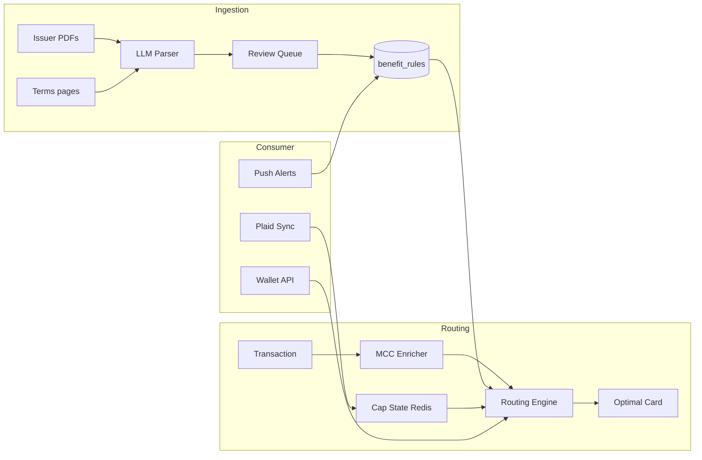

# Stipulate Architecture Specification

**Document ID:** `STIPULATE-ARCH-1.0`  
**Status:** Normative for engineering decisions

## 1. System context

Stipulate operates as a **benefit intelligence layer** between card issuers' stipulation documents and payment routing decisions. The platform is decomposed into:

1. **Ingestion plane** — PDF/web extraction, LLM parsing, human review queue
2. **Knowledge plane** — Catalog, benefit rules, MCC overrides, valuations
3. **Decision plane** — Routing engine, cap tracking, proxy-pay orchestration
4. **Consumer plane** — Wallet, alerts, Plaid linking, issuing cards
5. **Developer plane** — Org API keys, webhooks, SDKs, usage metering

## 2. Data flow



## 3. Package dependency graph

```text
schema ──┬── routing ──┬── api
         ├── mcc ──────┤
         ├── parser ───┤
         └── sdk

brand ───┬── ui ──┬── web
         └── mobile
```

**Rule:** `api` MUST NOT depend on `web` or `mobile`. Shared logic lives in `packages/`.

## 4. Persistence model

| Store | Responsibility | Consistency |
|-------|----------------|-------------|
| PostgreSQL | Orgs, keys, benefits, wallets, billing, audit | Strong |
| Redis | Routing cache, rate limits, cap counters | Eventual |
| S3 | Source PDFs, parser artifacts | Strong |
| SQS | Parser job queue | At-least-once delivery |

## 5. Authentication boundaries

| Boundary | Mechanism | Failure mode |
|----------|-----------|--------------|
| Org `/v1/*` | `X-API-Key` → org lookup | 401 unauthorized |
| Consumer `/public/*` | Session cookie | 401 unauthorized |
| Admin `/admin/*` | `X-Admin-Key` | 403 forbidden |
| Stripe webhooks | HMAC signature | 400 bad signature |

## 6. Deployment topology (production)

```text
                    ┌─────────────┐
                    │  Cloudflare │
                    │  / Vercel   │
                    └──────┬──────┘
                           │
         ┌─────────────────┼─────────────────┐
         ▼                 ▼                 ▼
   stipulate.io    api.stipulate.io    docs.stipulate.io
   (Next.js)       (Fly.io API)        (static)
                           │
              ┌────────────┼────────────┐
              ▼            ▼            ▼
           RDS PG      ElastiCache    S3/SQS
              │
              ▼
        Worker supervisor (Fly)
```

## 7. Scalability constraints

- Routing engine target: P99 < 20ms with warm Redis benefit index
- Rate limits: 60 req/min (free), 600 req/min (SaaS) per org
- Batch route: max 50 transactions per request
- Parser jobs: async via SQS; not on critical routing path

## 8. Disaster recovery

1. RDS automated backups (7-day retention minimum)
2. Redis AOF persistence for cap state
3. Rollback: revert Fly deployment; do NOT auto-revert migrations
4. Cache invalidation: `DEL stipulate:benefits:*` after benefit data changes

## 9. Related documents

- [PRODUCTION.md](./PRODUCTION.md)
- [monitoring.md](./monitoring.md)
- [environment.md](./environment.md)
- [PROXY_PAY.md](./PROXY_PAY.md)
